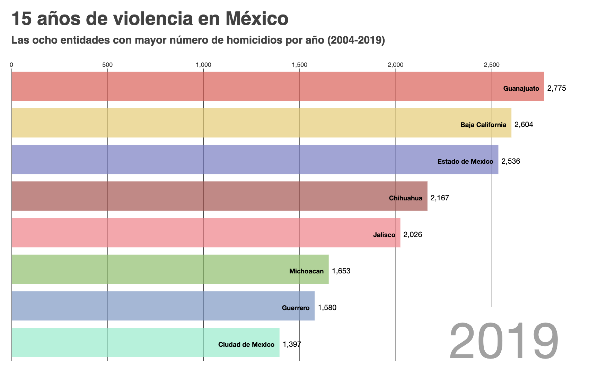

# Homicides in Mexico
## Bar chart race

This visualization displays the top 8 states in Mexico with the largest number of homicides per year, between 2004 and 2019.
The visualization was built with D3 library and it is displayed in an html. Python 3.7.6 was used to process the dataset. 
The data was extracted from Secretariado Ejecutivo del Sistema Nacional de Seguridad Pública. 

